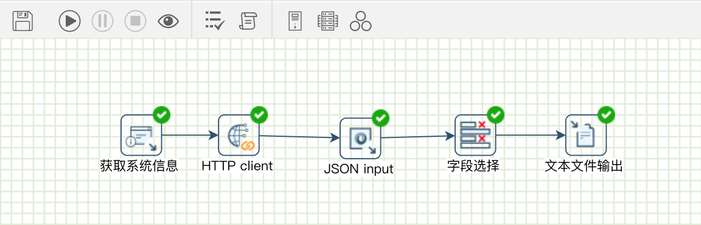
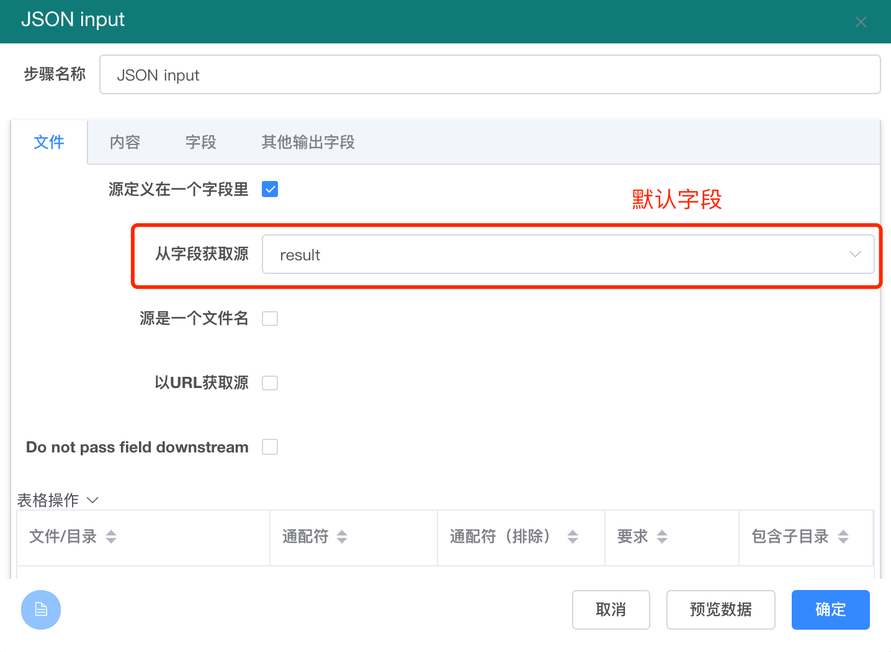
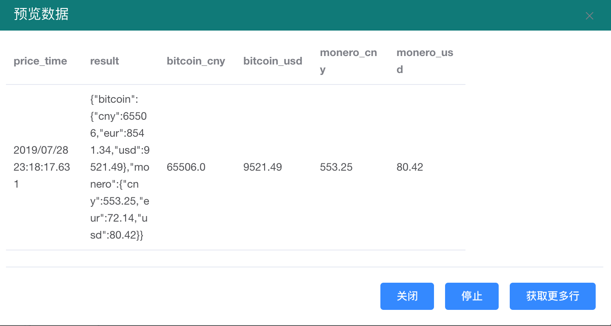
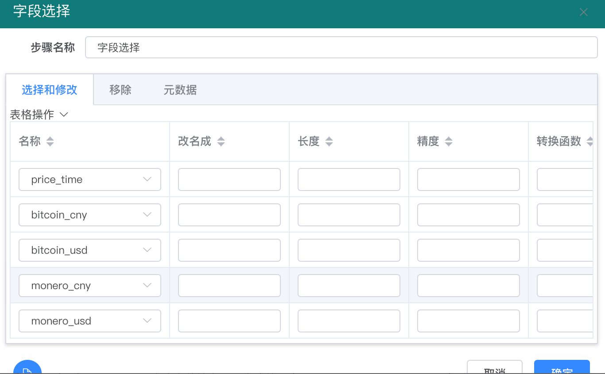
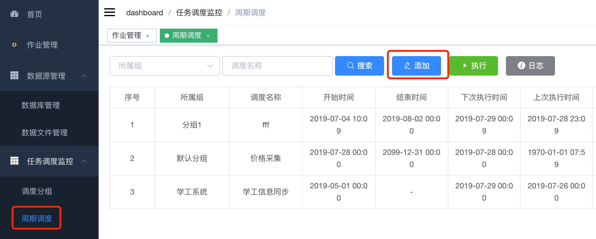
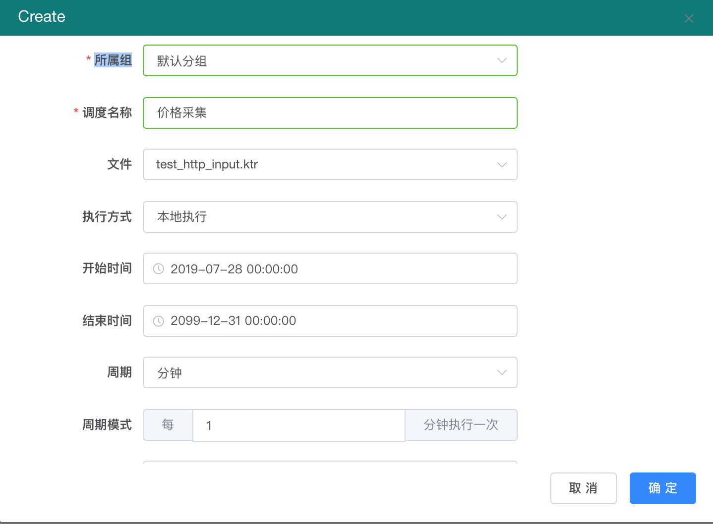

# 如何采集Http的 Json 数据到文件或数据库中

傲飞数据云平台提供了从 Http 服务/Rest 服务采集数据、解析数据的能力。

例如我们希望能 1 分钟采集一次比特币和门罗币两种数字货币的人民币、美元的两种价格，并把每分钟价格数据保存在数据库或文件中。

通过傲飞数据云平台，即使不会写代码和SQL，也可以在几分钟之内完成这个开发工作。

流程图如下：

流程图中用到的步骤说明如下：

1. 获取系统步骤：获取当前运行时间作为价格的时间，同时激活后面的Http 客户端步骤。
2. Http Client 步骤：调用 coingecko 网站的数字币价格接口，返回 Json 格式的比特币和门罗币的价格。
3. Json Input 步骤：解析Json 数据格式。
4. 字段选择步骤：选择要入库哪些字段
5. 文件输出（或表输出步骤）： 把数据保存在文件中或数据库中。&#x20;

注意：Http Client 步骤不能是第一个步骤，前面必须有获取系统信息或生成记录等步骤，用来产生记录。

首先在获取系统信息步骤中，获取当前的系统时间，保存在 price\_time 字段中：

.png>)

然后在 HTTP 客户端步骤中，设置 URL，如下图

使用的URL 接口是：[https://api.coingecko.com/api/v3/simple/price?ids=monero,bitcoin\&vs\_currencies=cny,usd](https://api.coingecko.com/api/v3/simple/price?ids=monero,bitcoin\&vs\_currencies=cny,usd) &#x20;

.png>)

设置完 Http Client 后，通过点击 【预览执行】按钮，就可以看到返回的数据，返回的数据默认保存在 result 字段中，如下图：

.png>)

.png>)

\

然后在后面的 Json input 步骤中，设置数据来源字段，就是Http input步骤的输出字段 - result 字段。

\

然后在 Json input 步骤的【字段】标签项下，设置要解析的 Json 数据的路径，如下图：

.png>)

\

然后在转换流程图的 Json input 步骤中上，再预览执行结果，如下图

在字段选择步骤里，去掉不需要的 result 步骤：

预览结果：

.png>)

最后的文本文件输出步骤中，选择或新建一个输出文件：

.png>)

\

在【内容】标签下，选中 追加 方式（不选择的话，后面数据会覆盖前面）

.png>)

\

这样整个流程配置完成，为了每分钟执行一次，还需要配置调度，如下图：

在【周期】调度里添加一个新调度

\

配置调度每分钟执行一次，如下图：

通过上述配置，可以每分钟采集一次数据了，如果想要提高采集频率，可以配置秒级别的周期采集。

配置后，在【监控】里，可以看到每次运行情况，如下图：

.png>)

如果想要把数据保存在数据库中，可以把最后的【文本文件输出】改成【表输出】。

如果想把每次采集每个币种都保存成一行记录，如下面的格式：

| price\_time1 | coin\_name | cny | usd |
| ------------ | ---------- | --- | --- |
| time1        | bitcoin    | p1  | p2  |
| time1        | monero     | p3  | p4  |
| time2        | bitcoin    | p5  | p6  |
| time2        | monero     | p7  | p8  |
|              |            |     |     |

可以后面再使用【列转行】步骤，将每次采集的 1行5列 数据转换成 2行4列数据。
