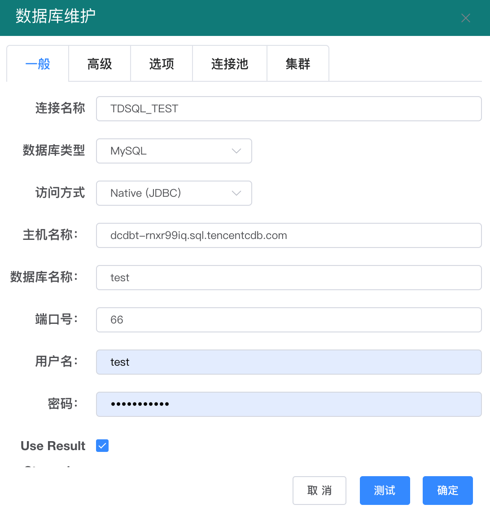
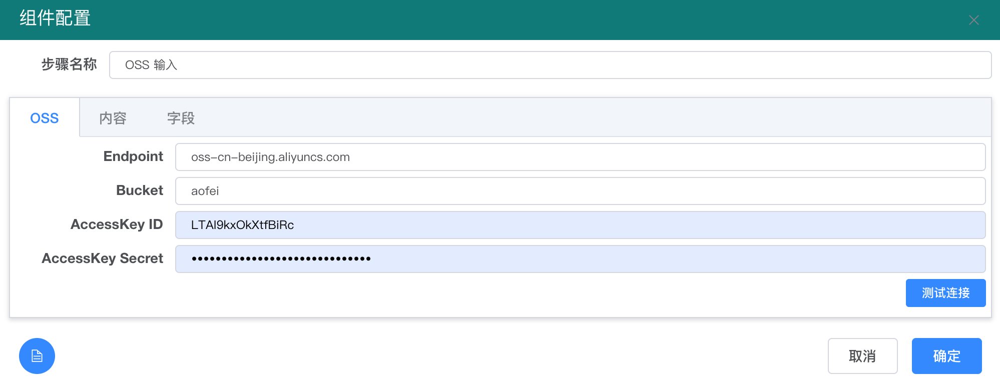
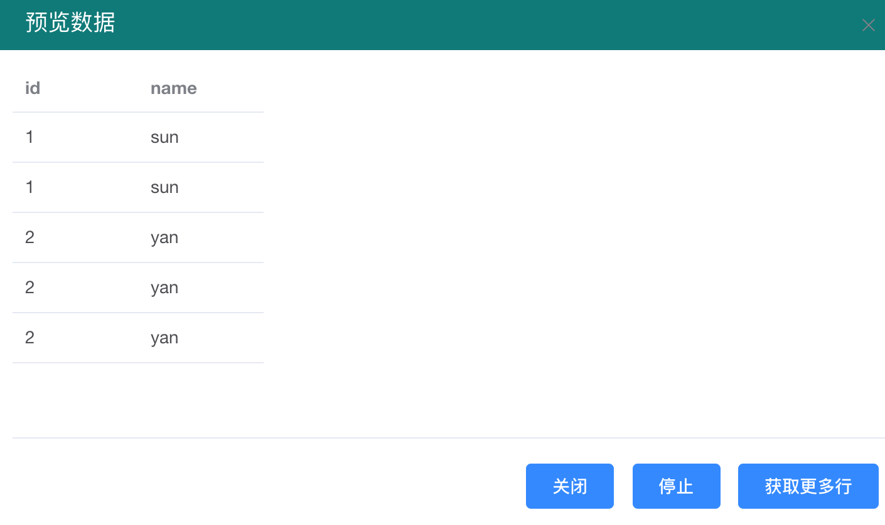
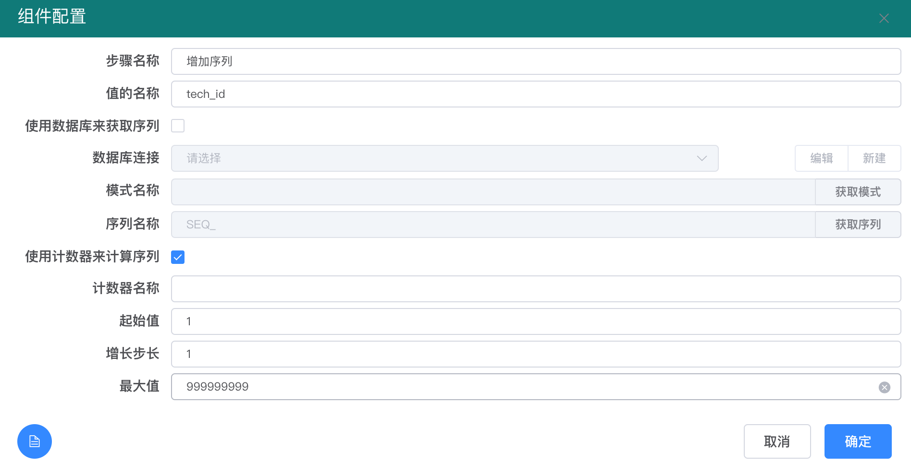
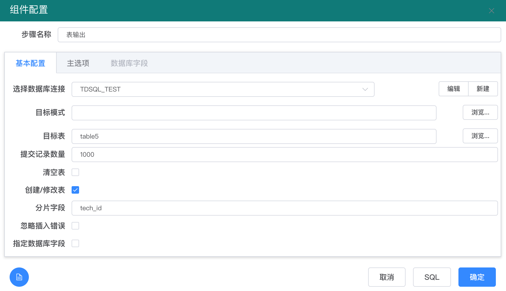
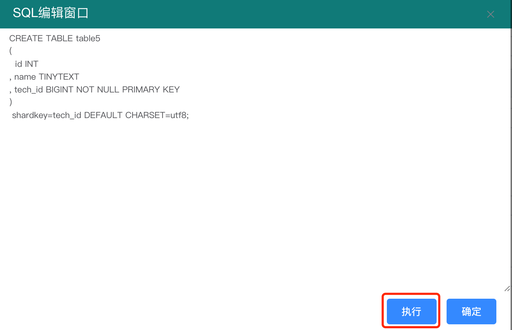

# 如何将阿里云 OSS 数据加载到腾讯 TDSQL 数据库中

傲飞云数据管理平台（[http://cloud.doetl.com](http://cloud.doetl.com)) 是一个基于开源ETL 工具 Pentaho Data Integration（Kettle）的在线数据处理、数据整合平台。熟悉Kettle 的同学都会使用该平台，不熟悉Kettle 的同学，也可以通过平台，快速学习Kettle 的 ETL作业设计方法。

傲飞云数据管理平台是多用户模式的 ETL 平台。用户注册后，就可以在平台上进行各种数据处理、清洗、整合等工作。 主要用于构建数据仓库、数据迁移、数据检验、数据发布等场景。支持各种主流的关系数据库，以及国内主流的云数据仓库。

本文介绍如何使用该平台，将阿里云  OSS 文件数据加载到腾讯的 TDSQL 数据库中

1. 登陆到 [http://cloud.doetl.com](http://cloud.doetl.com)  ，先在左侧的【数据库管理】里创建一个TDSQL数据库连接，如下图所示：&#x20;

2\. 然后在作业管理里，选择 【创建转换】，新创建一个转换。

.png>)

3\. 编辑新创建的转换，在左侧的【输入】分组里，选择 【OSS 输入】步骤，拖拽到右侧的画布上。&#x20;

.png>)

4\. 编辑【OSS输入】步骤，设置OSS 步骤的链接参数、文件名、字段名等信息如下图。

.png>)

.png>)

5\. 设置完【OSS步骤】后，在工具栏点击 【预览执行】 按钮，如果配置正确，会预览到OSS 里的文件数据。如下图：

.png>)

6\. 通过预览数据发现该表没有主键，我们使用【增加序列】步骤，增加一个自增列作为主键，【增加序列】步骤如下图所示：

7\. 最后使用【表输出】步骤，将数据输出到 TDSQL 数据库中。在使用该步骤前需要在【数据源管理】里，创建一个 TDSQL的链接（数据源选择 MySQL 即可）。

8\. 点击【SQL】 按钮，生成建表SQL，可以手动检查建表语句，并执行。也可以在运行过程中，自动创建表。

9\. 点击工具栏上的【执行】按钮，开始执行这个转换，如下图所示：

.png>)

如果执行正确，每个步骤上会显示正确图标，同时在【步骤度量】里会显示每个步骤的读写执行情况，如下图所示：

.png>)

\
10\. 注意： 需要在 TDSQL 的安全设置里，开通傲飞数据平台（ IP： 123.206.52.213）的访问权限。

