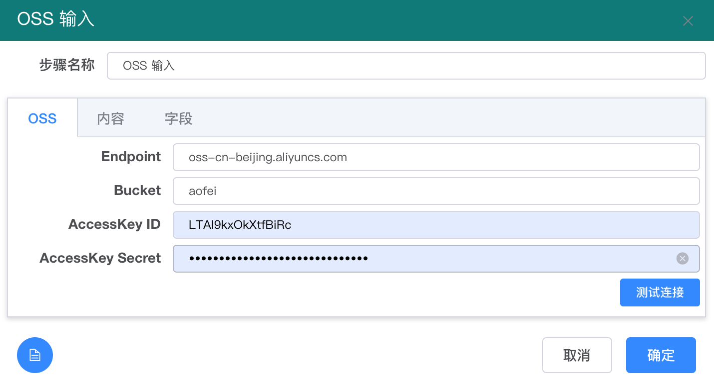
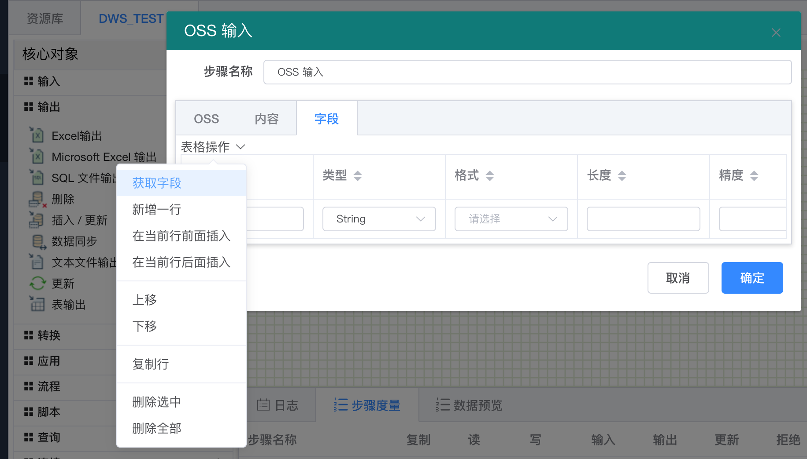
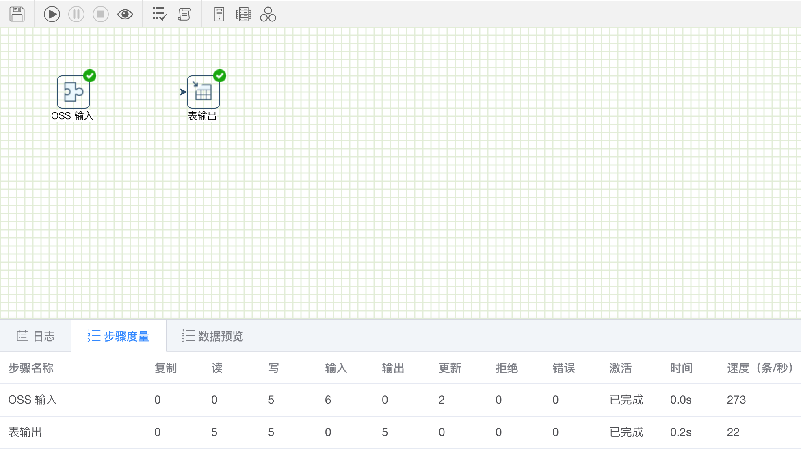

# 如何将阿里云 OSS 数据加载到华为 DWS 数据仓库

在华为 DWS 数据仓库集群上，使用用户名密码方式验证， 并绑定一个弹性IP，就可以生成一个JDBC 连接字符串，如下图：

.png>)

连接串中可以看到： IP 地址是 122.112.184.134， 端口 8000， 数据库名 postgres

根据上面的连接参数， 在 傲飞数据管理平台上 创建一个PostgreSQL的数据库连接（因为 DWS 是基于Postgre ，可以直接使用 Postgre 的 JDBC 驱动），如下图所示：

.png>)

创建完数据连接后，创建一个转换，只包括 OSS 输入和表输出 即可，熟悉Kettle 的同学，都知道如何配置了，如下图：

.png>)

其中【OSS输入】步骤的配置，如下图：

.png>)

【表输出】步骤里，选择事先设置的 DWS\_TEST 数据源和要加载的目标表。

.png>)

运行结果如下图所示：

