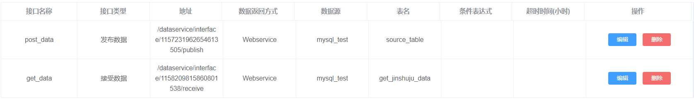

# 如何自动从金数据接收调查问卷数据并保存到数据库中

金数据是一个流行的表单数据采集平台，解决各场景的数据收集工作。但金数据采集的数据都保存在金数据平台下，用户需要登录才能下载采集到的数据并把数据导入到自己的业务系统中。尽管金数据提供了数据接口，可以把数据 Post 到一个指定的接口，但这需要用户具有一定的接口开发能力。通过傲飞云数据平台，用户通过简单的配置，就可以创建一个数据接收接口，接收从金数据或其他类似服务推送来的数据，并保存到数据库中。

## 创建调查问卷，开启数据推送

在金数据创建一个调查问卷

.png>)

点击表单【设置】，在【数据推送】页面点击开启，之后点击【字段对照表与JSON样例】，看到当前表单的字段对照表，如下图所示：

## 创建保存数据的表

将要保存的字段，在数据库中建立对应的数据表，用来保存从金数据接受的数据。

## 在云平台上配置接受数据接口

在云平台【数据库管理】中配置保存数据的数据库连接，如下图所示：

在【服务接口管理】中创建接受数据接口。【接口类型】选择接受数据，【数据源】选择要保存数据的数据库连接，【表名】填写保存数据的表。点击【添加字段】按钮，【名称】填写保存数据表的字段名，【路径】填写对应的字段解析路径，参考金数据表单【字段对照表与JSON样例】中的json样例。如下图所示：

.png>)

将要保存的字段配置好后，点击【确定】，生成接受数据接口【地址】

在【接口用户管理】中创建使用接口的用户名和密码。如下图所示：

.png>)

在【服务授权管理】中创建用户访问接口权限，【服务接口】选择接受数据的接口，【授权用户】选择使用接口的用户。如下图所示：

.png>)

将接受数据接口的【地址】添加上云平台的域名、端口，接口的授权用户名、密码等参数，组成一个完整的接受数据接口url，例如：

[http://cloud.doetl.com:8080/dataservice/interface/1158209815860801538/receive?username=user\&password=123\&text=json](http://cloud.doetl.com:8080/dataservice/interface/1158209815860801538/receive?username=etl\&password=etl\&text=json)

## 测试调查问卷数据接收

回到金数据【数据推送】页面，在HTTP POST地址文本框内填入接受数据接口url，点击【保存设置】

在【数据】页面手动添加数据，测试金数据表单的数据能否推送到保存数据的表中

