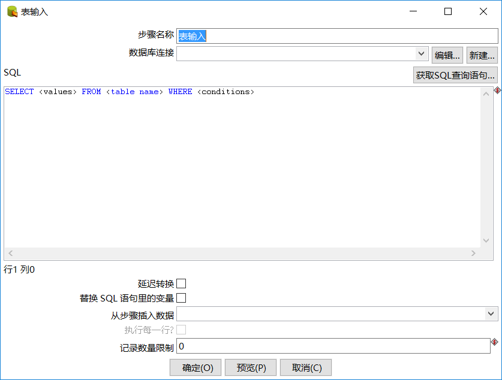

# 表输入

| 参数名称         | 参数说明                                               |
| ------------ | -------------------------------------------------- |
| 数据库连接        | 从下拉列表中选择连接的数据库名称                                   |
| 编辑（按钮）       | 点击来编辑当前数据库连接                                       |
| 新建（按钮）       | 点击来建立新的数据库连接                                       |
| SQL          | 设置SQL查询语句。你也可以点击【获取SQL查询语句】按钮来浏览表并且生成一个基本的select语句 |
| 延迟转换         | 选中后可以避免不必要的数据类型转换，从而显著提高性能                         |
| 替换SQL语句里的变量？ | 替换SQL语句里面的变量，选中                                    |
| 从步骤插入数据      | 设置信息来源的输入步骤名称。这个信息会插入到SQL语句中。插入信息的定位符用问号(?)表示      |
| 执行每一行？       | 为每一个单独的行执行查询，选中                                    |
| 记录数量限制       | 设置从数据库读取的行数。0表示读取所有行                               |

