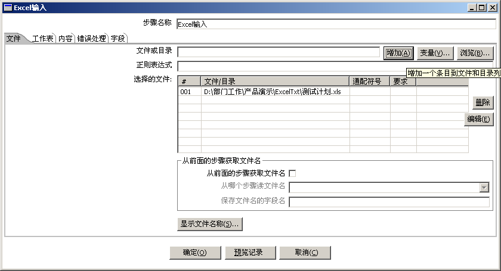
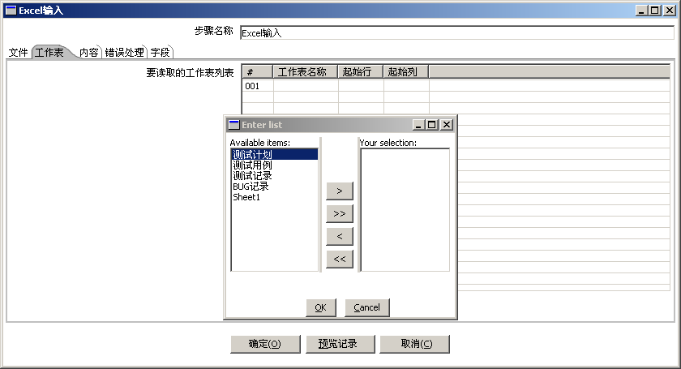

# Excel 输入

【文件】标签项：选择一个Excel文件或包含有 Excel 文件的目录。

| 参数名称  | 参数说明                                       |
| ----- | ------------------------------------------ |
| 文件或目录 | 设置要读取的Excel文件的名称，或一个目录。可以使用【浏览】按钮来选择文件或目录。 |
| 正则表达式 | 设置一个正则表达式来匹配一个目录下的部分Excel文件。               |
| 选择的文件 | 列出所有选中的文件，可以使用【增加】按钮将【文件或目录】中的文件添加到文件列表中。  |

【工作表】标签项：
选择工作薄中的一个或多个工作表，并通过指定工作表中的开始行号和开始列号来设要读取的内容。

| 参数名称  | 参数说明                                                   |
| ----- | ------------------------------------------------------ |
| 工作表名称 | 设置要读取的工作表的名称，可以通过【获取工作表名称】按钮来获取Excel工作薄中的所有工作表（Sheet）。 |
| 起始行   | 设置工作表中数据的开始行号（从0开始）                                    |
| 起始列   | 设置工作表中数据的开始列号（从0开始）                                    |

【内容】标签项：Sheet里内容的处理方式

| 参数名称     | 参数说明                                                                   |
| -------- | ---------------------------------------------------------------------- |
| 内容中包含列名  | 如果Sheet 中第一行是列名，则选中该选项。                                                |
| 列名所占行数   | 如果内容中第一行是列名，该选项可以设置列名一共占据几行。在列名比较长的情况下，列名可能会占据工作表的多行。（部分Kettle 版本有该参数） |
| 输出中不包括空行 | 如果Excel 内容中有空行，则跳过空行，向下继续读取。                                           |
| 遇到空行停止读取 | 在读取工作表内容的过程中如果遇到了空数据行则读取结束。                                            |
| 文件名称字段   | 在输出中增加一个字段来保存读取的 Excel 文件名。                                            |
| 工作表名称字段  | 在输出中增加一个字段来保存读取的 Excel 工作表名。                                           |
| 行号字段     | 在输出中增加一个字段来保存读取的 Excel 工作表中的每一行的行号，行号是在工作表中的实际行号。                      |
| 行数限制     | 指定要读取的最大行数, 0 代表读取所有行。                                                 |
| 编码       | 指定Excel 文件的编码，如果预览记录时有乱码，则需要改变编码。                                      |

【错误处理】作业项：遇到错误的处理方式

| 参数名称     | 参数说明                                                                             |
| -------- | -------------------------------------------------------------------------------- |
| 严格类型检查   | 如果选中该选项，当读取到的列数据类型和指定的列数据类型不一致时则读取失败. 否则会进行数据类型的转换，如果转换失败则产生错误行（行中的一个或多个数据读取失败）。 |
| 忽略错误     | 如果选中该选项，当读取数据行发生错误行时，则忽略发生的错误行。                                                  |
| 跳过错误行    | 如果选中该选项，将跳过发生错误的行。否则读取错误的数据将置为空值。                                                |
| 警告文件保存目录 | 设置警告信息保存目录，用于保存在读取数据过程中发生的警告。                                                    |
| 错误文件保存目录 | 设置错误信息保存目录，用于保存在读取数据过程中发生的错误。                                                    |
| 错误行号保存目录 | 设置错误行号保存目录，用于保存在读取数据过程中发生错误行的行号。                                                 |

【字段】标签项：
显示并设置从Excel工作表中读取到的所有字段，包括名称，类型，精度，刻度，转换格式等信息。

| 参数名称 | 参数说明                                                               |
| ---- | ------------------------------------------------------------------ |
| 名称   | 列出要读取的字段名，用户可以通过【获取字段名称】按钮获得所有字段名。                                 |
| 类型   | 指定字段的期望数据类型，如果和实际数据类型不符，可能在读取时会产生错误。                               |
| 长度   | 该字段的长度。                                                            |
| 精度   | 该字段的精度（对于Number类型）。                                                |
| 去除空格 | 去除空格的几种方式（不去除、左去除、右去除、全部去除）                                        |
| 格式   | 设置数据格式，主要用于日期和数值类型数据的格式。参考 [数据格式](../../untitled/shu-ju-ge-shi.md) |
|      |                                                                    |

Excel工作表中的数据，都有特定的数据类型，因此在读取数据时，需要为每个字段设置和实际相符的正确的数据类型。如果没有设置数据类型，则所有的数据都以字符串方式来读取，此时不同类型的数据转换为字符串时，会有不同的转换方式。

注意事项：

1\.  可以同时转换多个 Excel 文件，但这些Excel文件的工作表的格式应该是一样的，即数据的起始行和起始列是一样的。

2\.   如果有多个工作表数据都需要转换时，在【工作表】选项卡中选中所有要转换的工作表。

3\.    【工作表】选项卡中的【起始行】指工作表的列名行的行号（从0开始计算），如果列名行占据了Excel 表格的多行，则要在【内容】选项卡中的【列名所占行数】中设置。【起始列】指要读取的数据开始的列号（从0开始计算）

4\.    注意编码问题，如果在预览记录时发现有乱码，需要在【内容】选项卡中选择合适的编码。 5.    【字段】选项卡中对每个字段都应该设置正确的数据类型，精度和刻度。这样可以在【预览记录】时，就发现格式错误的数据（需要在【错误处理】选项卡中设置不忽略错误）。提前发现错误，可以免去很多麻烦。
