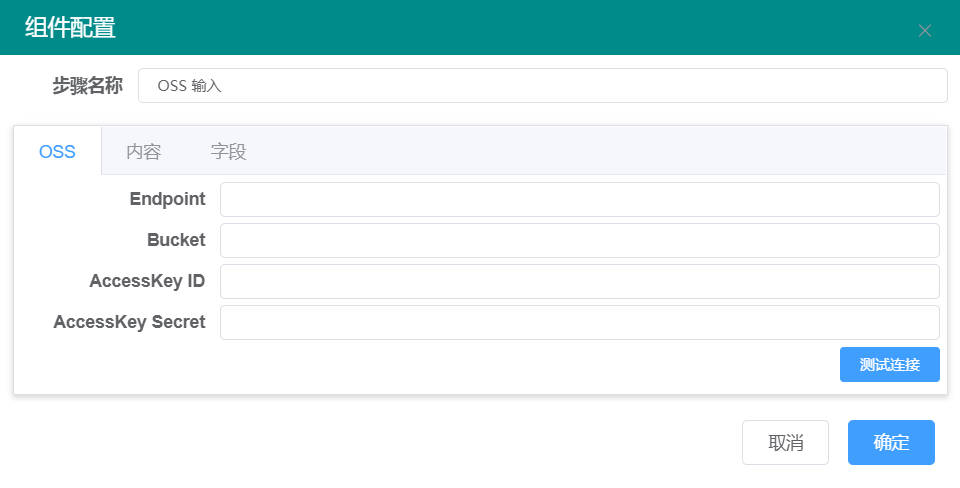
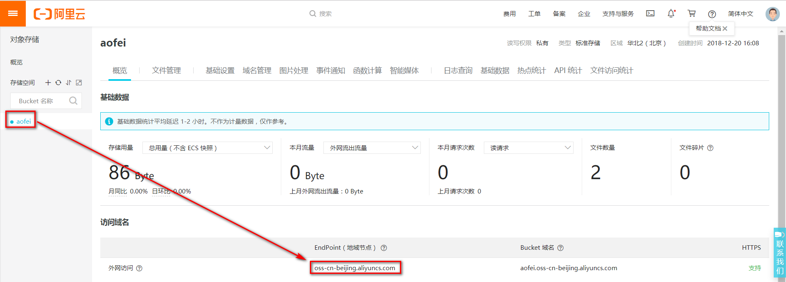
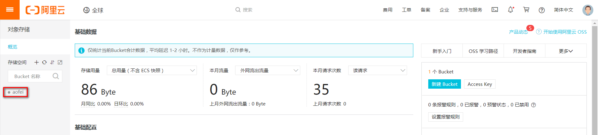
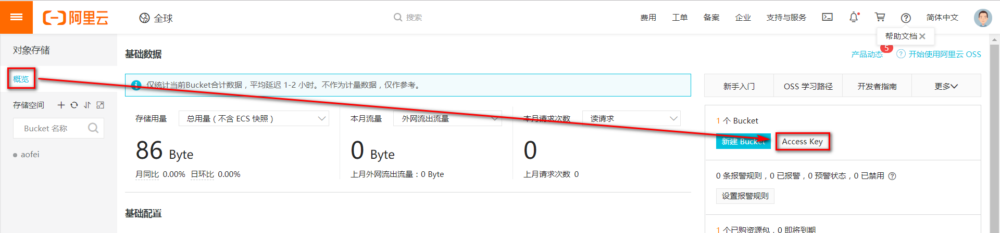
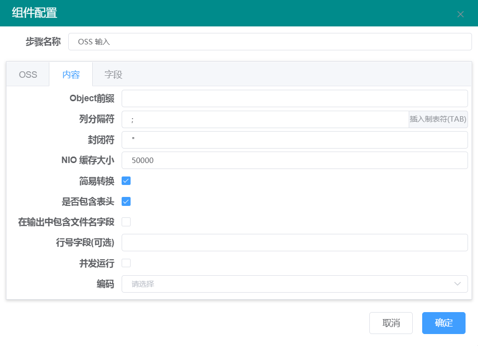
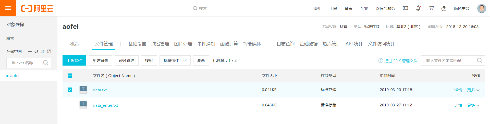
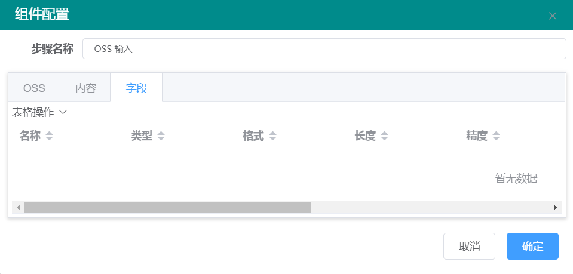

# OSS输入

【oss】标签项

| 参数名称            | 参数说明                                                                                                                    |
| --------------- | ----------------------------------------------------------------------------------------------------------------------- |
| Endpoint        | 表示 OSS 对外服务的访问域名                                                                                                        |
| Bucket          | 存储空间是您用于存储对象（Object）的容器，所有的对象都必须隶属于某个存储空间                                                                               |
| AccessKeyId     | 访问身份验证中用到的 AccessKeyId 和 AccessKeySecret。OSS 通过使用 AccessKeyId 和 AccessKeySecret 对称加密的方法来验证某个请求的发送者身份。AccessKeyId 用于标识用户 |
| AccessKeySecret | AccessKeySecret 是用户用于加密签名字符串和 OSS 用来验证签名字符串的密钥，其中 AccessKeySecret 必须保密                                                  |

Endpoint查找位置如下

Bucket查找位置如下

AccessKey查找位置如下

【内容】标签项

| 参数名称     | 参数说明                                                    |
| -------- | ------------------------------------------------------- |
| Object前缀 | OSS的文件名                                                 |
| 列分隔符     | 详见【[文本文件输入](wen-ben-wen-jian-shu-ru.md)】步骤【内容】标签项【列分隔符】 |
| 封闭符      | 详见【文本文件输入】步骤【内容】标签项【封闭符】                                |
| 是否包含表头   | 如果oss文件的第一行是表头，选中                                       |

Object前缀查找位置如下

【字段】标签项

点击【表格操作】，点击【获取字段】获得oss文件的字段列表。详见【[文本文件输入](wen-ben-wen-jian-shu-ru.md)】步骤【字段】标签项说明
