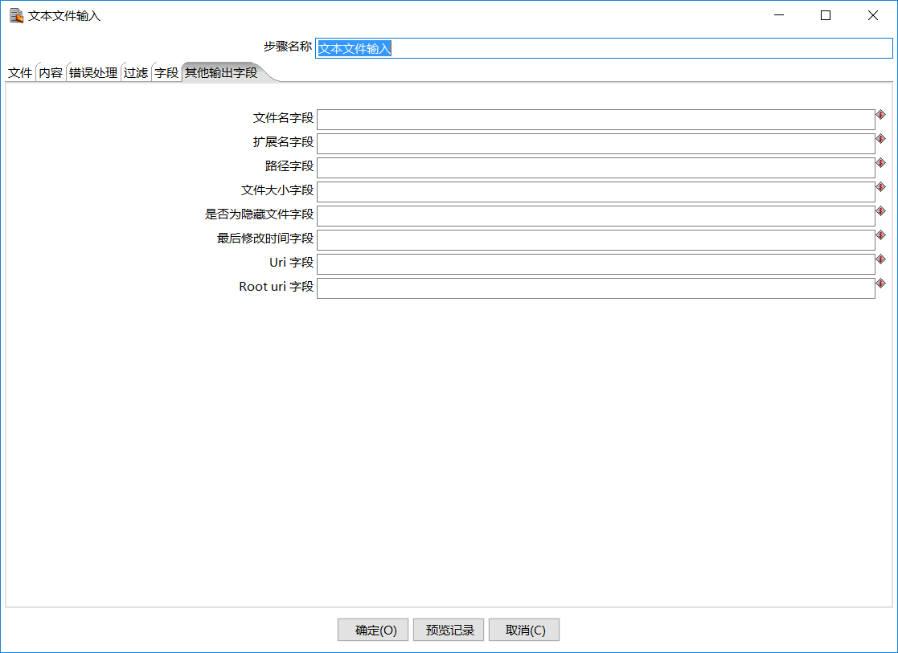

# 文本文件输入

【文件】标签项

使用【文件】标签输入源的以下连接信息。

| 选项        | 说明                                                                                                    |
| --------- | ----------------------------------------------------------------------------------------------------- |
| 文件或目录     | 如果未在字段中定义源，请指定源位置。点击【浏览】按钮来浏览你的源文件或者目录。点击【增加】按钮来将源包含在【选中的文件】表格中。如果源位置在字段中定义了，参考下面【从上一步骤获取文件名】来指定你的文件名 |
| 正则表达式     | 指定正则表达式来匹配指定目录中的文件名                                                                                   |
| 正则表达式（排除） | 指定正则表达式来排除指定目录中的文件名                                                                                   |

【正则表达式】

使用【文件】标签中的【正则表达式】或【正则表达式（排除）】字段，来通过正则表达式形式的通配符搜索文件。正则表达式比使用'\*'和'？'通配符更复杂。

以下表达式是这些类型的搜索的例子：

| 文件名    | 正则表达式                             | 选中的文件                                 |
| ------ | --------------------------------- | ------------------------------------- |
| /dirA/ | .userdata.\\.txt                  | 查找/ dirA /中包含userdata并以.txt结尾的所有文件    |
| /dirB/ | AAA.\\\*                          | 查找/ dirB /中名称以AAA开头的所有文件              |
| /dirC/ | \\\[ENG:A-Z\\]\\\[ENG:0-9\\].\\\* | 查找/ dirC /中名称以大写字母开头，后跟数字的所有文件（A0-Z9） |

【选中的文件】表格

显示要用作输入源位置的文件或目录。指定【文件或目录】后，点击【增加】按钮将填充此表。【文本文件输入】步骤将尝试连接到指定的文件或目录，当点击【增加】按钮来将其包含在【选中的文件】表格中时。

该表格包含以下列：

| 列        | 描述                                             |
| -------- | ---------------------------------------------- |
| 文件/目录    | 点击【增加】按钮指示源位置，在【文件或目录】中指定它后                    |
| 通配符      | 指定正则表达式以匹配指定目录中的文件名。有关语法示例，请参考上面【正则表达式】。       |
| 通配符号（排除） | 指定正则表达式来排除指定目录中的文件名。有关语法示例，请参考上面【正则表达式】。       |
| 要求       | 指定是否需要文件的属性。指定【是】，如果需要文件但未找到，则会生成错误。 否则，将跳过文件名 |
| 包含子目录    | 子文件夹是否包含在源位置中                                  |

单击【删除】按钮来从表中删除源。单击【编辑】来从表中删除源并将其返回到【文件或目录】选项。

【从上一步骤获取文件名】

你可以指定文件名并将其传递给【文本文件输入】步骤，这样允许文件名来自任何源，例如文本文件或数据库表。

| 选项            | 描述                                      |
| ------------- | --------------------------------------- |
| 从以前的步骤接受文件    | 启用选项来从上一步骤获取文件名。                        |
| 输出上一步骤的文件字段   | 启用此选项可将进入步骤的所有先前字段添加到步骤输出中。 这类似于join选项。 |
| 步骤            | 输入从中读取文件名的步骤名称。                         |
| 上一步骤中包含文件的字段名 | 输入在输入步骤中字段的名称以确定要使用的文件名                 |

【显示已连接的文件】

在【文件】标签字段中输入信息后，如果要查看源文件名或数据内容，请选择操作按钮。

| 按钮            | 描述                   |
| ------------- | -------------------- |
| 显示文件名         | 单击来显示连接到步骤的源的文件名。    |
| 显示文件内容        | 单击来显示所选文件的原始内容。      |
| 显示来自第一条数据行的内容 | 单击来显示所选文件的第一个数据行的内容。 |

【内容】标签项

在【内容】标签中，使用以下选项，你可以指定源文件的格式。

| 选项           | 描述                                                                                                                                  |
| ------------ | ----------------------------------------------------------------------------------------------------------------------------------- |
| 文件类型         | 选择CSV或固定长度。 根据您选择的文件类型，将显示相应的界面，当你单击【字段】标签中的【获取字段】按钮时。                                                                              |
| 分隔符          | 指定用于在单行文本中分隔字段的字符，通常为分号或制表符。 单击【插入制表符】按钮来在【分隔符】字段中放置制表符。 默认值为分号（;）。                                                                 |
| 封闭符          | 指定一个可选字符用来封闭字段，如果该字段包含一个分隔符。 默认值为双引号（“）。                                                                                            |
| 封闭符内允许包含换行符  | 未实现。                                                                                                                                |
| 逃逸字符         | 指定一个或多个字符来指示另一个字符是否是常规文本的一部分。 例如，如果一个反斜杠（\）是转义字符，而且单引号（'）是一个封闭符或分隔符，那么文本'Not the nine o\\'clock news'被解析为Not the nine o’clock news。 |
| 头部           | 如果你的文本文件有标题行（文件中的第一行），选中。 你可以使用【头部行数】来指定标题行出现的次数。                                                                                   |
| 尾部           | 如果你的文本文件有页脚行（文件中的最后一行），选中。 你可以使用【尾部行数】来指定页脚行出现的次数。                                                                                  |
| 数据中包含换行      | 如果你处理的数据行在超出指定页面限制后换行。 你可以使用【换行的次数】来指定换行的次数。 头和尾从不被视为会换行。                                                                           |
| 分页打印         | 当以上文本处理选项在设计为输出到行式打印机的文本文件上失败，选中。 您可以使用【文档头部行数】跳过介绍性文本和【每页记录行数】来定位数据行。                                                              |
| 压缩           | 在下拉列表中选择，如果您的文本文件是在Zip或GZip存档中。 仅读取存档中的第一个文件。                                                                                       |
| 去掉空行         | 如果您不想将空行发送到下一个步骤，选中                                                                                                                 |
| 输出文件名        | 如果您要将文件名作为输出的一部分，选中，并使用【文件名字段】输入包含文件名的字段的名称。                                                                                        |
| 输出记录行号       |                                                                                                                                     |
| 格式           |                                                                                                                                     |
| 编码方式         |                                                                                                                                     |
| 记录数量限制       |                                                                                                                                     |
| 严格按照格式解析日期   |                                                                                                                                     |
| 本地日期格式       |                                                                                                                                     |
| 将文件添加到结果文件列表 |                                                                                                                                     |

【错误处理】标签项

【过滤】标签项

【字段】标签项

【其他输出字段】标签项

